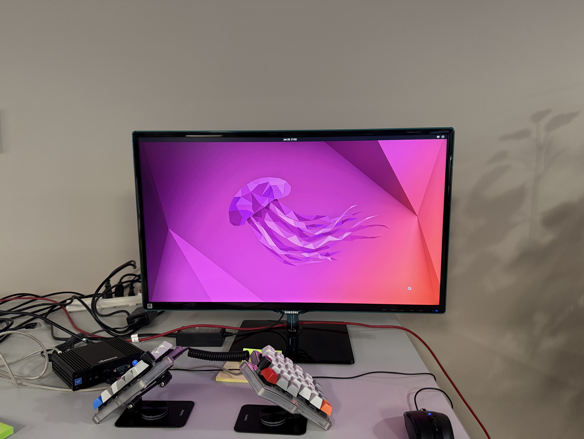
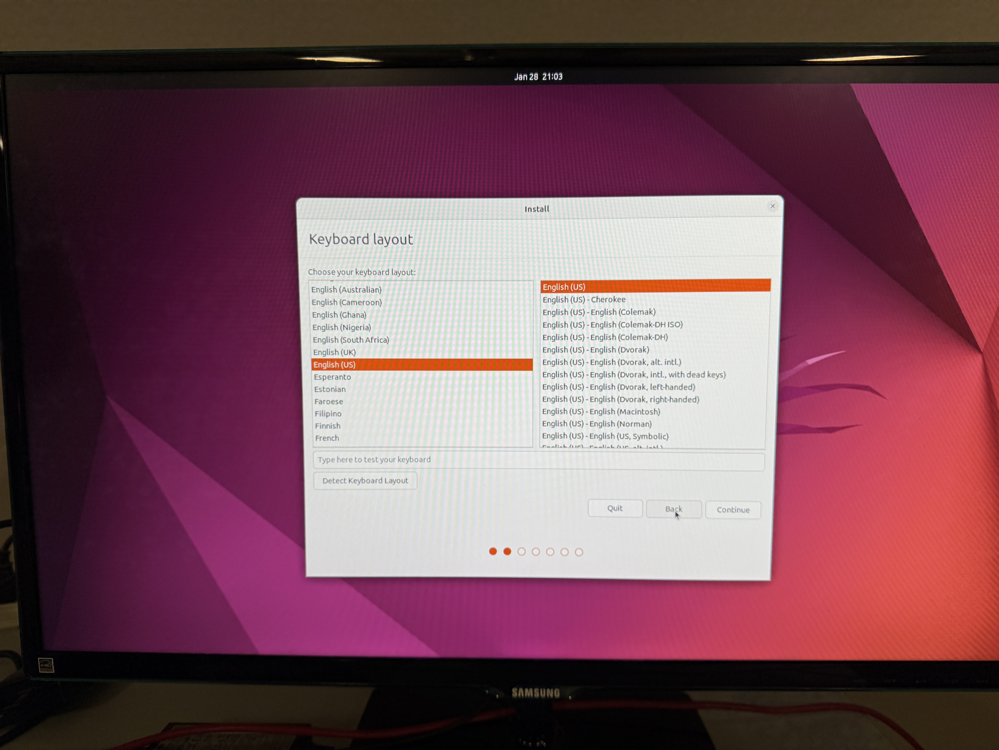
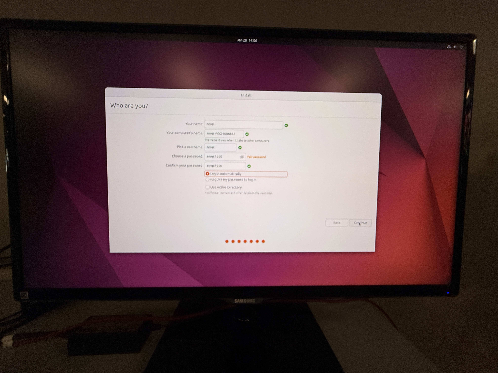
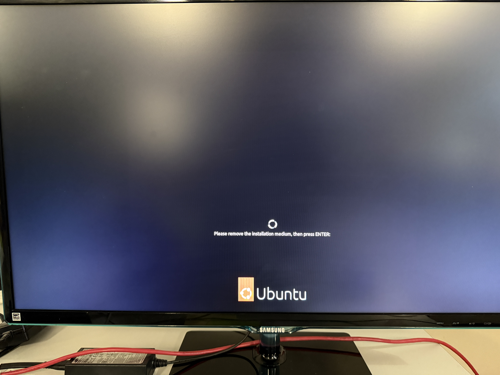
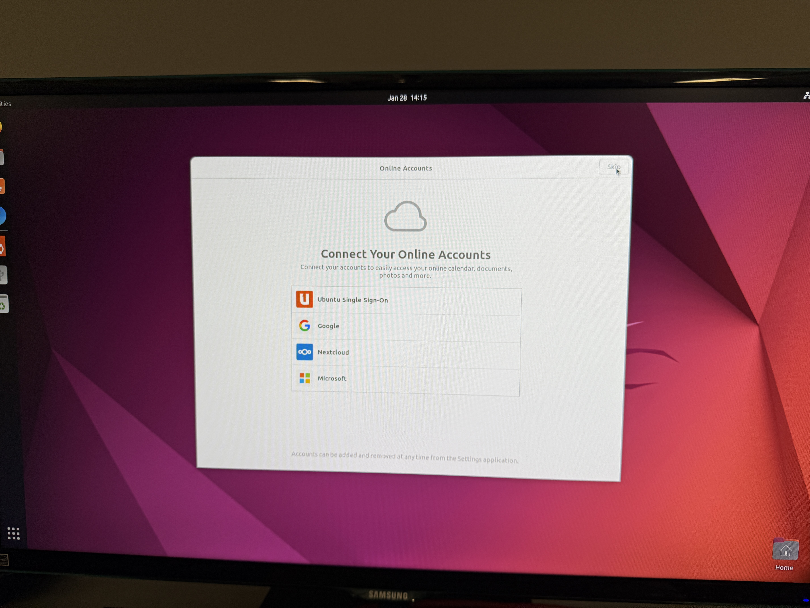
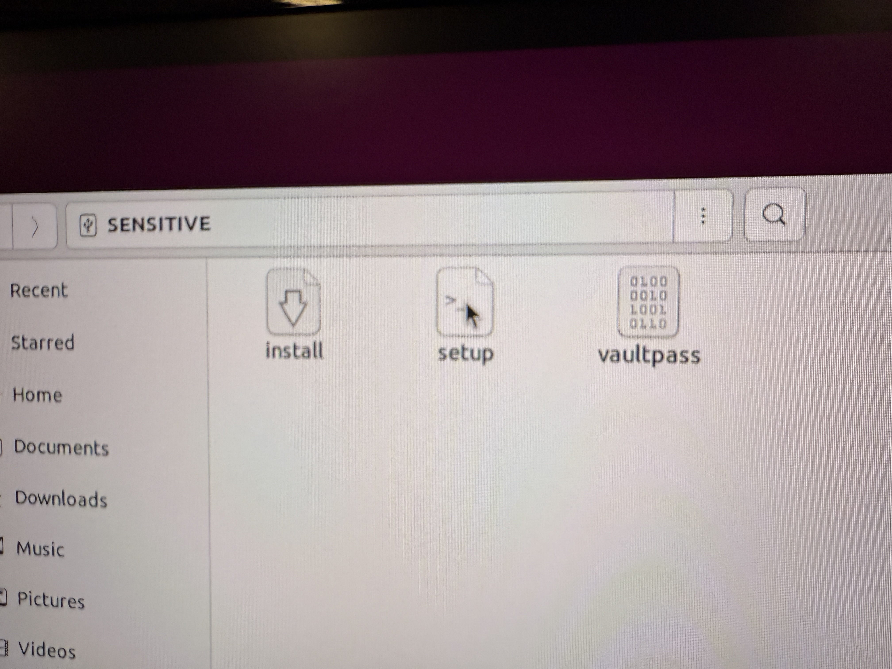
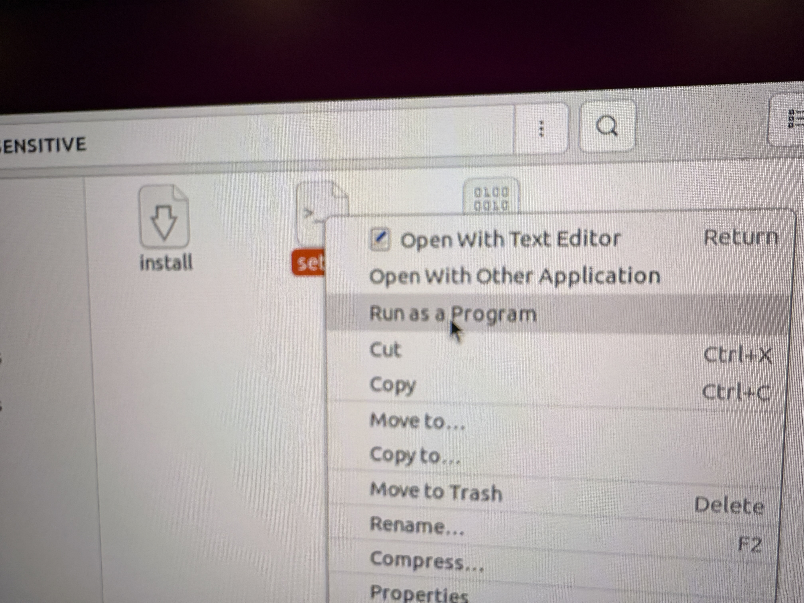
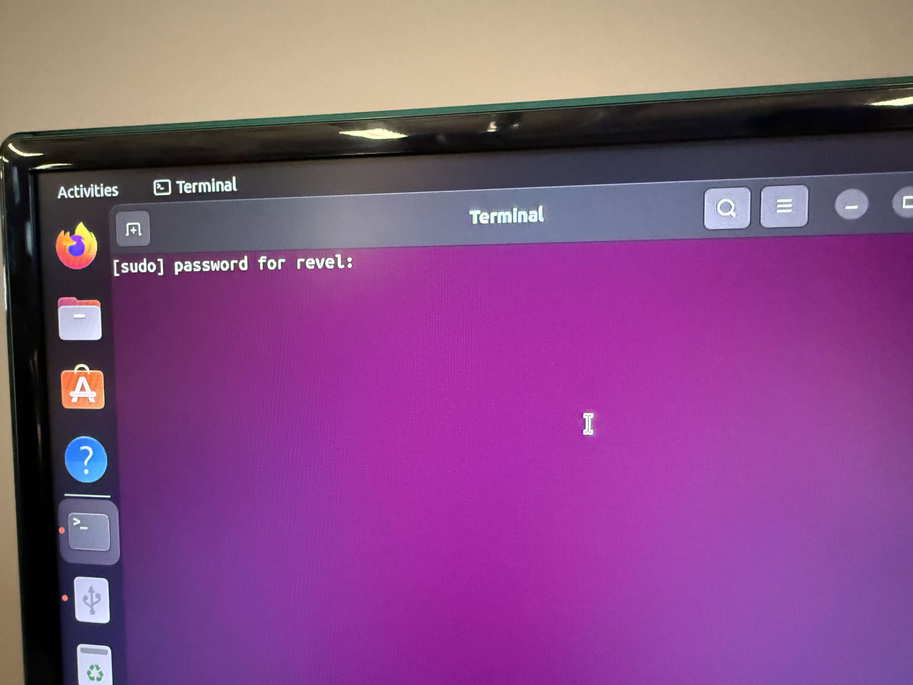
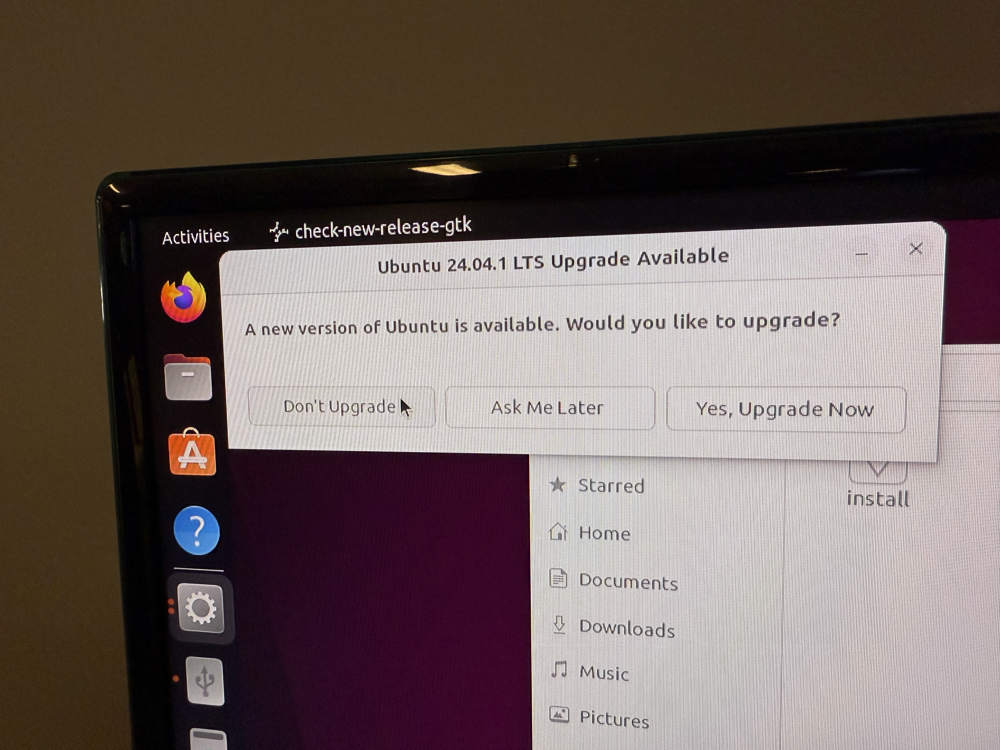
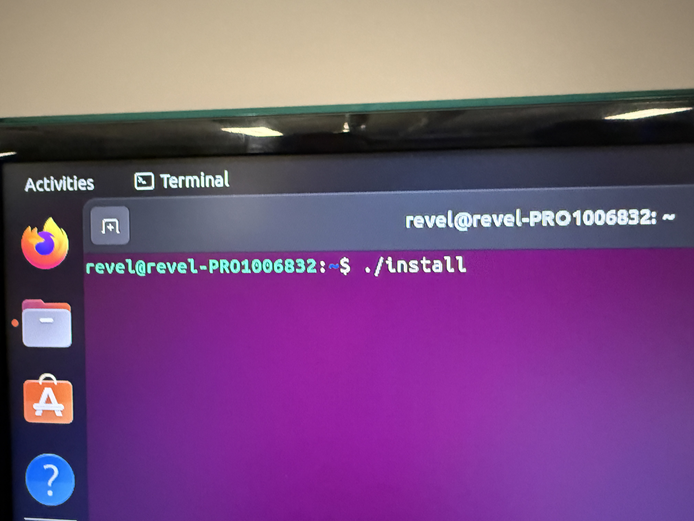

# SinageOS Player Provisioner

## Provisioning Ubuntu




















then open a terminal and type:

```bash
wget -qO- https://tinyurl.com/revelprovis | sudo sh
```

press enter and you should be good to go.
